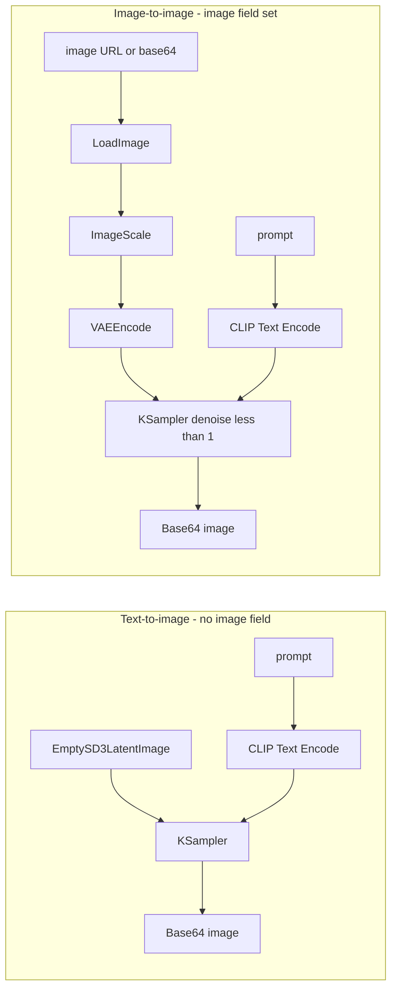

# Flux Krea RunPod Hub — Enhanced

[한국어 README 보기](README_kr.md)

**Enhanced fork** of the [Flux-krea_Runpod_hub](https://github.com/wlsdml1114/Flux-krea_Runpod_hub) template by [wlsdml1114](https://github.com/wlsdml1114). It keeps the same RunPod Serverless + ComfyUI + Flux Krea stack, and adds API features that the upstream Hub template does not expose—most notably **image-to-image (img2img)** via an optional `image` field in the request.

| | Upstream ([Flux-krea_Runpod_hub](https://github.com/wlsdml1114/Flux-krea_Runpod_hub)) | This repo (**Flux-krea_Runpod_hub_enhanced**) |
| --- | --- | --- |
| Text-to-image (txt2img) | Yes | Yes (unchanged API) |
| Image-to-image (img2img) | No | **Yes** — `image` + optional `denoise` |
| Input image formats | — | HTTP(S) URL, raw base64, `data:image/...;base64,...` |
| LoRA (0–3) | Yes | Yes (unchanged) |
| Custom UNET via Network Volume | Yes | Yes (unchanged) |
| ComfyUI workflows | 4 JSON files (txt2img only) | Same 4 files; img2img nodes injected at runtime in `handler.py` |

[](https://console.runpod.io/hub/wlsdml1114/Flux-krea_Runpod_hub)

Deploy **this repository** if you need img2img. Deploy the upstream Hub template if you only need txt2img and want the official RunPod Hub listing.

[Flux Krea](https://bfl.ai/blog/flux-1-krea-dev) is a high-quality image model built on the Flux architecture. This worker wraps it in ComfyUI for RunPod Serverless.

---

## What this fork adds

### 1. Image-to-image (`image` parameter)

Send a **source image** together with your **prompt**. The worker transforms the image according to the text instead of starting from an empty latent (txt2img).

- **Without `image`**: standard text-to-image (same behavior as upstream).
- **With `image`**: image-to-image pipeline is enabled automatically.

Supported `image` values:

| Format | Example | Notes |
| --- | --- | --- |
| Public URL | `"https://example.com/photo.jpg"` | Downloaded inside the worker (60s timeout). |
| Raw base64 | `"iVBORw0KGgo..."` | PNG/JPEG/GIF/WebP detected from file header. |
| Data URI | `"data:image/png;base64,iVBORw0..."` | Prefix is stripped before decode. |
| Local path | `"/path/on/worker/input.png"` | Only useful if the file already exists on the worker (e.g. Network Volume). |

The worker then:

1. Resolves the image to a temp file on disk.
2. Waits for ComfyUI to be ready.
3. Uploads the file to ComfyUI (`POST /upload/image`).
4. Injects nodes into the active workflow: `LoadImage` → `ImageScale` → `VAEEncode`.
5. Connects `VAEEncode` to `KSampler` and sets `denoise`.

`width` and `height` still apply: the source image is scaled to those dimensions (Lanczos) before encoding.

### 2. Controllable img2img strength (`denoise`)

| Parameter | Required | Default | Range | When used |
| --- | --- | --- | --- | --- |
| `denoise` | No | `0.75` | `0.0` – `1.0` | Only when `image` is set |

- **Lower** (e.g. `0.5`–`0.65`): keeps more of the original composition and layout.
- **Higher** (e.g. `0.8`–`1.0`): follows the prompt more aggressively; closer to a full redraw.

Ignored for plain txt2img requests (upstream uses `denoise: 1` in the workflow JSON).

### 3. Clearer errors for image input

Invalid URLs, corrupt base64, or failed ComfyUI uploads return structured errors, for example:

```json
{ "error": "Invalid input image: image must be a valid URL, base64 string, data URI, or an existing file path" }
```

```json
{ "error": "Failed to upload input image: ..." }
```

---

## Generation modes



**img2img works with LoRAs and custom models** — use the same `lora` and `model` fields as txt2img. The handler picks the workflow by LoRA count (0–3), then applies img2img wiring on top.

---

## ✨ Features (inherited + enhanced)

* **Text-to-image**: High-quality images from text (Flux Krea + dual CLIP).
* **Image-to-image** *(this fork)*: Transform an existing image using prompt + optional `denoise`.
* **Multi-LoRA**: Up to 3 LoRAs; workflow JSON selected automatically.
* **Custom UNET**: Override default model via Network Volume path.
* **ComfyUI**: API-format workflows; img2img nodes added dynamically (no separate workflow files).

## 🎨 Engui Studio (upstream ecosystem)

[](https://github.com/wlsdml1114/Engui_Studio)

The original template was designed for **Engui Studio**. This fork remains API-compatible for txt2img and extends the API with `image` / `denoise`. Engui Studio integration is not maintained here unless you wire these fields yourself.

---

## 🚀 RunPod Serverless layout

| File | Role |
| --- | --- |
| `Dockerfile` | ComfyUI, Flux Krea weights, dependencies |
| `handler.py` | Request parsing, img2img upload, workflow patching, ComfyUI API |
| `entrypoint.sh` | Starts ComfyUI, then the RunPod handler |
| `flux_krea_dev_api_*.json` | Base workflows for 0–3 LoRAs (txt2img) |

---

## API reference

### `input` fields

All parameters except `model`, `lora`, `image`, and `denoise` are **required** for every job.

| Parameter | Type | Required | Default | Description |
| --- | --- | --- | --- | --- |
| `prompt` | `string` | **Yes** | — | Text description for generation or transformation. |
| `seed` | `integer` | **Yes** | — | Random seed. |
| `guidance` | `float` | **Yes** | — | CFG / guidance scale (`cfg` on KSampler). Flux Krea often uses values around `1`. |
| `width` | `integer` | **Yes** | — | Output width in pixels (also used to scale input image in img2img). |
| `height` | `integer` | **Yes** | — | Output height in pixels. |
| `model` | `string` | No | `flux1-krea-dev_fp8_scaled.safetensors` | Custom UNET path (Network Volume). |
| `lora` | `array` | No | `[]` | List of `[path, weight]` pairs (Network Volume). Max 3. |
| `image` | `string` | No | — | **Enhanced:** source image for img2img (URL, base64, or data URI). |
| `denoise` | `float` | No | `0.75` | **Enhanced:** img2img strength; ignored without `image`. |

**LoRA entries:** `[ "/my_volume/loras/style.safetensors", 0.8 ]` — `weight` typically `0.0`–`2.0`. More than 3 LoRAs: only the first 3 are used.

---

### Request examples

**Text-to-image (same as upstream):**

```json
{
  "input": {
    "prompt": "a beautiful landscape with mountains and a lake",
    "seed": 12345,
    "guidance": 1,
    "width": 1024,
    "height": 1024
  }
}
```

**Image-to-image — public URL:**

```json
{
  "input": {
    "prompt": "turn this photo into a watercolor painting, soft pastel colors",
    "seed": 12345,
    "guidance": 1,
    "width": 1024,
    "height": 1024,
    "image": "https://example.com/photo.jpg",
    "denoise": 0.65
  }
}
```

**Image-to-image — base64 data URI:**

```json
{
  "input": {
    "prompt": "cyberpunk city at night, neon lights, rain",
    "seed": 12345,
    "guidance": 1,
    "width": 1024,
    "height": 1024,
    "image": "data:image/png;base64,iVBORw0KGgoAAAANSUhEUgAAAAEAAAABCAYAAAAfFcSJAAAADUlEQVR42mP8z8BQDwAEhQGAhKmMIQAAAABJRU5ErkJggg=="
  }
}
```

**Image-to-image + LoRA + custom model:**

```json
{
  "input": {
    "prompt": "anime style portrait, detailed eyes",
    "seed": 42,
    "guidance": 1,
    "width": 1024,
    "height": 1024,
    "image": "https://example.com/portrait.jpg",
    "denoise": 0.7,
    "model": "/my_volume/models/custom_model.safetensors",
    "lora": [
      ["/my_volume/loras/style_lora.safetensors", 0.8]
    ]
  }
}
```

**Custom model / LoRA only (upstream-compatible):**

```json
{
  "input": {
    "prompt": "a beautiful landscape with mountains and a lake",
    "seed": 12345,
    "guidance": 1,
    "width": 1024,
    "height": 1024,
    "model": "/my_volume/models/custom_model.safetensors",
    "lora": [
      ["/my_volume/loras/style_lora.safetensors", 0.8],
      ["/my_volume/loras/character_lora.safetensors", 1.0]
    ]
  }
}
```

---

### `denoise` tuning guide (img2img)

| `denoise` | Typical use |
| --- | --- |
| `0.4` – `0.55` | Color grading, light style tweaks, preserve structure |
| `0.6` – `0.75` | Style transfer, moderate prompt-driven changes (default `0.75`) |
| `0.8` – `0.95` | Strong reinterpretation; only hints of original remain |
| `1.0` | Near full regeneration from encoded latent (still not identical to txt2img) |

Start at `0.65`–`0.75` and adjust per use case.

---

### Output

**Success**

| Field | Type | Description |
| --- | --- | --- |
| `image` | `string` | Base64-encoded PNG (raw base64 string, no data-URI prefix required in response). |

```json
{
  "image": "iVBORw0KGgoAAAANSUhEUgAAAAEAAAABCAYAAAAfFcSJAAAADUlEQVR42mNkYPhfDwAChwGA60e6kgAAAABJRU5ErkJggg=="
}
```

**Error**

| Field | Type | Description |
| --- | --- | --- |
| `error` | `string` | Human-readable failure reason. |

Examples: generation failure, invalid `image`, upload failure, ComfyUI connection timeout.

---

## 🛠️ Deploy and call

1. Create a RunPod Serverless endpoint from **this** Git repository (not only the upstream Hub listing unless you forked it there too).
2. After the image build finishes, send jobs with `POST` to your endpoint URL and the `input` JSON above.
3. Rebuild/redeploy after pulling changes to `handler.py` (img2img logic lives there, not in the static workflow JSON files).

### 📁 Network Volumes

Custom `model` and `lora` paths require a Network Volume mounted on the endpoint. Default weights are baked into the Docker image.

```
/my_volume/
├── models/
│   └── custom_model.safetensors
└── loras/
    └── style_lora.safetensors
```

Use full paths in requests, e.g. `"/my_volume/loras/style_lora.safetensors"`.

For **large** assets, prefer Network Volumes over huge base64 strings in `image`. For **one-off** img2img, URL or reasonably sized base64 is fine.

---

## 🔧 Workflows

Static workflow files (txt2img base):

| File | LoRAs |
| --- | --- |
| `flux_krea_dev_api_nolora.json` | 0 |
| `flux_krea_dev_api_1lora.json` | 1 |
| `flux_krea_dev_api_2lora.json` | 2 |
| `flux_krea_dev_api_3lora.json` | 3 |

When `image` is present, `handler.py` adds nodes **60** (`LoadImage`), **62** (`ImageScale`), and **61** (`VAEEncode`) and rewires node **31** (`KSampler`) `latent_image` and `denoise`.

Core pipeline nodes (unchanged from upstream):

- Dual CLIP loader, CLIP text encode, ConditioningZeroOut  
- UNET loader (Flux Krea), VAE load/decode  
- KSampler, SaveImage  

---

## 🎯 LoRA tips

1. Weights `0.5`–`1.0` are a good starting range.  
2. Combine LoRAs carefully; not all stacks are compatible.  
3. LoRAs must match Flux architecture.  
4. More LoRAs → longer runs and higher VRAM.  
5. LoRAs apply to **both** txt2img and img2img.

---

## 🙏 Credits and upstream

| Project | Link |
| --- | --- |
| **Upstream template (fork base)** | [wlsdml1114/Flux-krea_Runpod_hub](https://github.com/wlsdml1114/Flux-krea_Runpod_hub) |
| **RunPod Hub listing (upstream)** | [console.runpod.io/hub/wlsdml1114/Flux-krea_Runpod_hub](https://console.runpod.io/hub/wlsdml1114/Flux-krea_Runpod_hub) |
| **Flux Krea model** | [bfl.ai – Flux.1 Krea dev](https://bfl.ai/blog/flux-1-krea-dev) |
| **ComfyUI** | [comfyanonymous/ComfyUI](https://github.com/comfyanonymous/ComfyUI) |

Model weights, Docker base image (`wlsdml1114/multitalk-base`), and core workflow design come from the upstream project. This enhanced repository only extends the **handler** and **documentation**; it does not replace upstream maintenance.

If you use this fork, consider starring or linking the [original repository](https://github.com/wlsdml1114/Flux-krea_Runpod_hub) as the base implementation.

---

## 📄 License

Follows the same license terms as the upstream Flux Krea / ComfyUI template. See the upstream repository for details.
